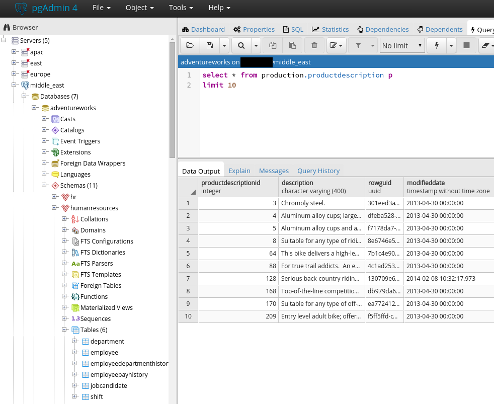

# AdventureWorks for Postgres

This is based off the work done by [lorint](https://github.com/lorint/AdventureWorks-for-Postgres) and [josibake](https://github.com/NorfolkDataSci/adventure-works-postgres/) with minor script changes to fix relative paths and updated docs for remote server installation (in this case, an AWS RDS cluster). The included csv's have been converted already to be compatible with postgres. If you would like the original files, head over to [Adventure Works 2014 OLTP](https://msftdbprodsamples.codeplex.com/downloads/get/880662) download page. The download includes a script for loading the data into MSSQL Server.

## Getting started

Clone this repo in its entirety to your local machine. You will need [psql](https://www.postgresql.org/download/) installed on the machine which receives the files. The instructions below will send the csvs through the network to the target DB. This is NOT written to commit the files to a local DB.

### Run the script

Once you have confirmed your postgres install, log into the server:

	$ psql -h myserver.mydomain.com -U myusername -d postgres
	Password for user myusername: 
	psql.bin (10.3, server 10.1)
	SSL connection (protocol: TLSv1.2, cipher: ECDHE-RSA-AES256-GCM-SHA384, bits: 256, compression: off)
	
	Type "help" for help.
	Cannot read termcap database;
	using dumb terminal settings.

Create the database:
	postgres=> CREATE DATABASE adventureworks;

Log out:
	postgres=>\q

Run the script from your local machine:
	$ psql -h myserver.mydomain.com -U myusername -d adventureworks -f install.sql

You should see something like the following while it processes:

	COPY 19972
	Copying data into Person.CountryRegion
	
	COPY 238
	CREATE SCHEMA
	COMMENT
	 Copying data into HumanResources.Department
	
	COPY 16
	 Copying data into HumanResources.Employee
	
	COPY 290
	Copying data into HumanResources.EmployeeDepartmentHistory

When completed, the import should look as follows:

	
